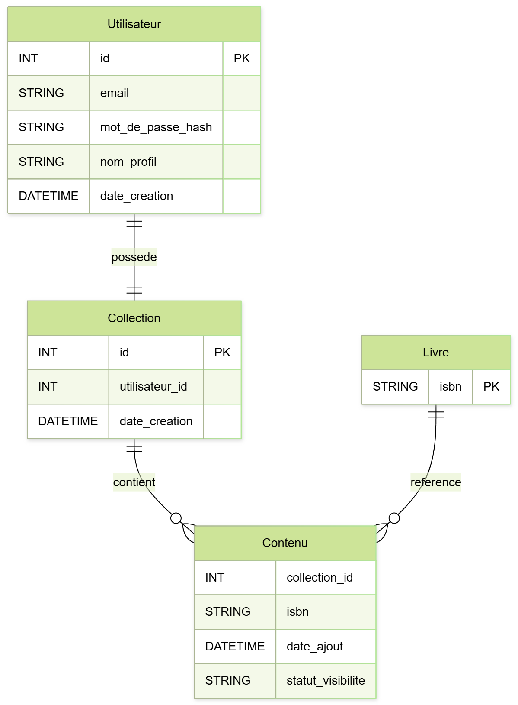
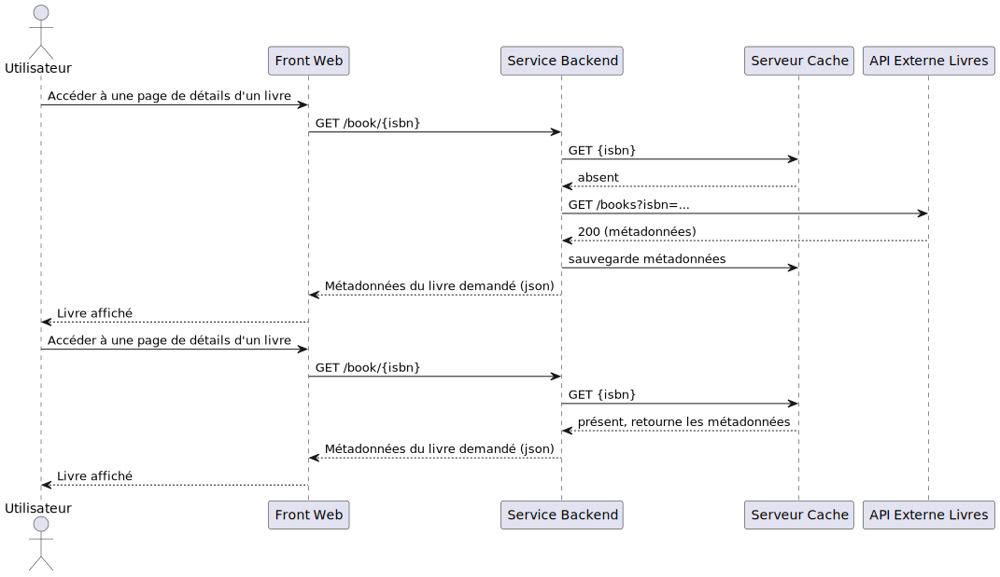
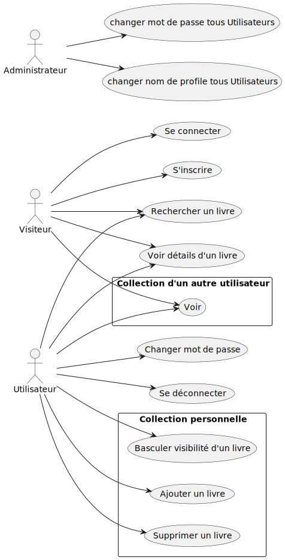

# Projet WikiBouquin - Cahier des charges

WikiBouquin est une plateforme web qui permet de rechercher et consulter tous les livres disponibles dans le monde, sans aucune limite géographique.
Les utilisateurs peuvent créer un compte personnel afin de constituer leur propre collection numérique de livres.
Chaque utilisateur possède un profil unique qu’il peut partager via un lien public, facilitant ainsi la découverte de nouvelles lectures.

Le projet répond au besoin d’un accès centralisé, libre et communautaire à l’ensemble des livres existants.
Il vise à simplifier la recherche, la gestion et le partage de collections littéraires personnelles.
Les utilisateurs ont également la possibilité de choisir la visibilité de chaque livre de leur collection (publique ou privée) selon leurs préférences.

La cible principale du projet regroupe les passionnés de lecture, les étudiants, les chercheurs et toute personne souhaitant organiser ou partager ses livres préférés.
L’interface sera conçue pour être simple, intuitive et totalement responsive, garantissant une expérience fluide sur ordinateur et smartphone.

Les principaux risques concernent la gestion du volume massif de données, la performance du moteur de recherche et la protection des comptes utilisateurs.
Pour y remédier, le projet prévoit l’utilisation de bases de données optimisées, de sauvegardes régulières et d’un chiffrement renforcé des informations sensibles.

## Fonctionnalités

### MVP

**Gestion des utilisateurs :**
- Création de compte (email, mot de passe, nom de profil)
- Connexion et déconnexion
- Modification du mot de passe
- Profil public partageable via lien

**Recherche et consultation de livres :**
- Recherche de livres par nom, auteur ou ISBN
- Consultation de la page de détail d'un livre
- Intégration avec l'API externe de livres

**Gestion de collection personnelle :**
- Ajout de livres à sa collection unique
- Suppression de livres de sa collection
- Définition de la visibilité de chaque livre (Public/Privé)
- Consultation de sa propre collection
- Consultation des collections publiques d'autres utilisateurs

**Administration de base :**
- Modification du mot de passe d'un utilisateur
- Modification du nom de profil d'un utilisateur

### Evolutions potentielles

- Renforcement du rôle d'administrateur avec plus de possibilités (suppression d'utilisateurs, modération, statistiques)
- Possibilité de créer plusieurs collections par utilisateur avec visibilité publique/privée par collection
- Suivi avancé des livres : statut de lecture (lu, en cours, à lire), page actuelle, dates d'achat/début/fin de lecture

## Architecture

**Frontend Web Responsive :**
- Un site web responsive pour assurer une expérience utilisateur optimale sur tous les appareils (desktop, tablette, mobile)
- Interface unique servant à la fois de frontend utilisateur et de backoffice administrateur pour réduire le temps de développement et maintenir une cohérence visuelle

**Serveur Backend :**
- **Serveur unique** : Gestion centralisée de l'authentification, des utilisateurs et des collections de livres dans un seul serveur pour simplifier le développement et le déploiement
- **Intégration API externe** : Connexion directe à l'API [OpenLibrary](https://openlibrary.org/developers/api) pour accéder à la base de données complète des livres existants

**Cache Redis :**
- Mise en place d'un cache Redis entre le serveur backend et l'API externe pour :
  - Réduire la latence des requêtes
  - Diminuer la charge sur l'API externe
  - Améliorer les performances globales de l'application
  - Assurer une meilleure disponibilité en cas de problème avec l'API externe

**Base de données PostgreSQL :**
- Choix de PostgreSQL pour sa robustesse, ses performances et sa compatibilité avec les données relationnelles
- Stockage sécurisé des informations utilisateurs et des collections personnelles

**Containerisation Docker :**
- Utilisation de Docker et Docker Compose pour :
  - Faciliter le déploiement et la mise à l'échelle
  - Assurer la portabilité entre environnements (développement, test, production)
  - Simplifier la gestion des dépendances
  - Permettre un déploiement cohérent et reproductible

## Technologies

**Frontend :**
- **React** : Framework JavaScript populaire offrant une grande flexibilité, une vaste communauté et un écosystème riche de composants réutilisables
- **TypeScript** : Ajout du typage statique à JavaScript pour améliorer la maintenance du code, réduire les erreurs et faciliter le travail en équipe

**Backend :**
- **Node.js** : Environnement d'exécution JavaScript côté serveur permettant d'utiliser le même langage que le frontend
- **Express.js** : Framework web minimaliste et flexible pour Node.js, facilitant la création d'APIs REST rapides et solides

### Navigateurs compatibles

L'application sera compatible avec les navigateurs modernes suivants :

**Desktop :**
- Chrome 90+
- Firefox 88+
- Safari 14+
- Edge 90+

**Mobile :**
- Chrome Mobile 90+
- Safari Mobile 14+
- Firefox Mobile 88+

## Arborescence

La liste des **routes** prévues est détaillée dans le fichier [ROUTES.md](ROUTES.md).

## User Stories

### Visiteur

- En tant que visiteur, je veux créer un compte avec email, mot de passe et nom de profil, afin d’accéder à ma collection personnelle.
 - En tant que visiteur, je veux consulter la page publique d’un utilisateur, afin de voir les livres qu’il a rendus publics.
 - En tant que visiteur, je veux rechercher un livre par son nom, son auteur ou son isbn.
 - En tant que visiteur, je veux consulter la page de détail d'un livre.

 ### Utilisteur

 Toutes les User Stories des visiteurs s'appliquent également à l'utilisateur si applicable.

 - En tant qu’utilisateur, je veux me connecter avec email et mot de passe, afin d’accéder à ma collection et gérer mes livres.
 - En tant qu’utilisateur, je veux me déconnecter, afin de sécuriser mon compte.
 - En tant qu’utilisateur, je veux changer mon mot de passe, afin de sécuriser mon compte.
 - En tant qu’utilisateur, je veux ajouter un livre  à ma collection.
 - En tant qu’utilisateur, je veux supprimer un livre de ma collection, afin de garder mon catalogue à jour.
 - En tant qu’utilisateur, je veux définir la visibilité d’un livre (Public/Privé) dans ma collection, afin de contrôler ce qui est visible par les autres.

### Administrateur

- En tant qu'administrateur, je veux changer le mot de passe de n'importe quel utilisateur afin d'aider un utilisateur bloqué.
- En tant qu'administrateur, je veux changer le nom de profile d'un utilisateur afin de sécurisé mon site si un nom d'utilisateur est innaproprié ou si un utlisateur a besoin d'aide.

## Documents de conception

### Le diagramme ERD (Entité-Relation-Diagram)

### Un diagramme de séquence d'une fonctionnalité complexe
Accéder à la page d'un livre avec cache "chaud" et "froid".

### UML

### Le Dictionnaire de données : liste des entités et de leurs attributs
[DICTIONNAIRE_DONNEES.md](DICTIONNAIRE_DONNEES.md)

## Élément Graphique

### Wireframe

### Maquette
encours ...

### Charte Graphique

